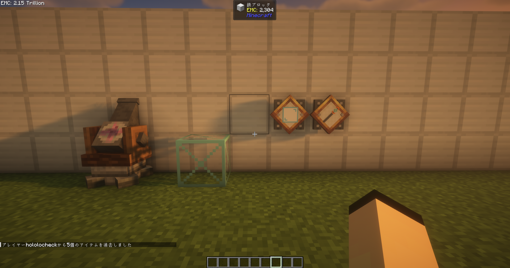
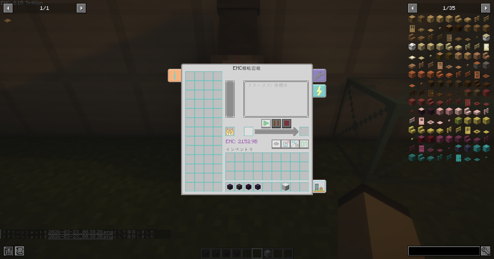

# Create: Not EMC Schematic Cannon

<p align="center">
  
</p>

<p align="center">
  <strong>Create × ProjectE × AE2 — All-in-one Building Automation</strong>
</p>

<p align="center">
  
  
  
  
</p>

[日本語](#japanese) | [English](#english)

---

<a id="japanese"></a>
## 🇯🇵 日本語 (Japanese)

**Create** の概略図キャノンと **ProjectE** のEMCシステムを組み合わせたNeoForge Mod です。AE2 MEストレージとの連携にも対応し、大規模建築の完全自動化を実現します。

**本バージョンでは、旧版（EMC Schematic Cannon）に含まれていたProjectE/EMC要素を完全に削除しています。**

### 📦 依存Mod
| Mod | バージョン | 必須 |
|-----|-----------|------|
| [Create](https://modrinth.com/mod/create) | 6.0.9+ | ✅ |
| [Applied Energistics 2](https://modrinth.com/mod/ae2) | 19.2.17+ | ❌ (任意) |
| [JEI](https://modrinth.com/mod/jei) | 19.27+ | ❌ (任意) |

### 📸 スクリーンショット

<p align="center">
  
  <br><em>追加アイテム・ブロック一覧</em>
</p>

<p align="center">
  
  <br><em>第2世代GUI — 展開式タブ・ブロックリスト</em>
</p>

### ✨ 追加アイテム・ブロック

#### 🔫 EMC概略図砲（ブロック）
CreateのSchematic CannonとProjectEのEMCを統合した全自動建築マシンです。

| 項目 | 詳細 |
|------|------|
| エネルギー容量 | 100,000 FE |
| 設置コスト | 500 FE / ブロック |
| 設置速度 | 1〜256 blocks/tick（スライダーで調整） |

**機能:**
- 概略図スロットに概略図を入れて開始ボタンで自動建築
- **AE2 MEストレージ連携**: AE2ケーブルを隣接接続するとMEネットワークからアイテムを自動取り出し
- **チェスト連携**: 隣接するチェストからアイテムを取り出し
- **ストレージモード切替**: AE2+チェスト / AE2のみ / チェストのみ の3モード
- **置換モード**: 固体ブロック置換しない / 固体→固体 / 固体→任意 / 固体→空気
- **ブロックエンティティ保護**: チェスト等のBEを上書きしない保護機能
- **不足ブロックスキップ**: 在庫切れブロックを飛ばして続行
- **概略図再利用**: 完了後に概略図を消費しないオプション

**第2世代GUI:**
- 展開式の設定タブ（歯車アイコン）— 6つの設定ボタンを2×3グリッドに配置
- 展開式のスピードタブ（稲妻アイコン）— テクスチャベースのスライダーで速度調整
- 展開式の情報タブ（左側）— MOD説明テキスト、スクロール対応
- ブロックリスト — 4列×13行、マウスホイールスクロール、EMCアイコン表示

---

#### 🪄 空中設置杖（アイテム）
FEエネルギーを消費して、空中にフレームブロックを設置できる杖です。

| 項目 | 詳細 |
|------|------|
| エネルギー容量 | 400,000 FE |
| 設置コスト | 1,000 FE / ブロック |
| 最大設置数 | 400個（満充電時） |
| 設置距離 | 1〜15ブロック（デフォルト: 5） |

**操作方法:**
| 操作 | 動作 |
|------|------|
| 右クリック（空中） | 視線方向の設定距離にフレームブロックを設置 |
| 右クリック（ブロック面） | クリックした面の隣にフレームブロックを設置 |
| Shift + 右クリック | この杖で設置した全フレームブロックを一括撤去 |
| Shift + スクロール | 設置距離を調整（1〜15ブロック） |
| Shift + ホイール押込み | 設置距離をデフォルト(5)にリセット |

- エネルギーバーがアイテム上に表示（赤→緑のグラデーション）
- クリエイティブモードではエネルギー消費なし
- 設置したブロックの位置はアイテムに記録され、一括撤去に使用

---

#### 📋 範囲指定ボード（アイテム）
2点を指定して3D範囲を設定するツールです。フィラーモードや撤去モードで使用します。

| 項目 | 詳細 |
|------|------|
| レイキャスト距離 | 最大64ブロック |
| モード数 | 3（通常 / Pos1編集 / Pos2編集） |

**操作方法:**
| 操作 | 動作 |
|------|------|
| 右クリック（ブロック） | 座標を設定（通常モード: Pos1→Pos2交互） |
| 右クリック（空中） | 64ブロック先までレイキャストして座標設定 |
| Shift + 右クリック | 座標をクリア（モードにより対象が異なる） |
| Alt + スクロール | モード切替（通常 ↔ 編集） |
| Shift + スクロール（編集モード） | 編集対象を切替（Pos1 / Pos2） |

**モード詳細:**
- **通常モード**: 右クリックでPos1→Pos2を交互に設定。Shift+右クリックで両方クリア
- **Pos1編集モード**: 右クリックで常にPos1のみ設定。Shift+右クリックでPos1のみクリア
- **Pos2編集モード**: 右クリックで常にPos2のみ設定。Shift+右クリックでPos2のみクリア

---

#### 🧱 フレームブロック（ブロック）
空中設置杖で設置される透明な足場ブロックです。

| 項目 | 詳細 |
|------|------|
| 硬度 | 0.0（素手で即破壊） |
| 光透過 | あり（空を透過） |
| 窒息 | なし |
| 効果音 | 足場（Scaffolding） |
| ピストン | 押すと破壊 |

- 松明やレッドストーンを設置可能
- 視界を遮らない透明ブロック
- 建築の足場として使用

---

### 🔧 フィラーモード

EMC概略図砲を**フィラーモード**に切り替えると、範囲指定ボードで指定した範囲に対して以下の操作が可能です:

| モード | 説明 |
|--------|------|
| 埋め立て | 範囲内の空気ブロックを指定ブロックで埋める |
| 完全消去 | 範囲内の全ブロックを空気に置換 |
| 撤去 | 範囲内のブロックを撤去し、EMC変換またはストレージに搬入 |
| 壁 | 範囲の外壁のみを作成 |
| タワー | 範囲内に柱を作成 |
| 箱 | 範囲の外殻（6面）を作成 |
| 円壁 | 範囲内に円筒形の壁を作成 |

### 🔧 ビルド方法

```bash
gradlew.bat build
```

出力: `build/libs/emcschematicannon-x.x.x.jar`

### 📝 アップデート情報 
**"This fork**

> * **EMC機能の削除**: EMC機能の削除を行いました


---

<a id="english"></a>
## 🇺🇸 English (English)

A NeoForge mod based on **Create**'s Schematic Cannon, featuring integration with **Applied Energistics 2 (AE2)** for full building automation.
**Note: This version is a fork that has completely removed the ProjectE/EMC elements found in the original "EMC Schematic Cannon."**

### 📦 Dependencies

| Mod | Version | Required |
|-----|---------|----------|
| [Create](https://modrinth.com/mod/create) | 6.0.9+ | ✅ |
| [Applied Energistics 2](https://modrinth.com/mod/ae2) | 19.2.17+ | ❌ (Optional) |
| [JEI](https://modrinth.com/mod/jei) | 19.27+ | ❌ (Optional) |

### 📸 Screenshots

<p align="center">
  
  <br><em>Added Items & Blocks</em>
</p>

<p align="center">
  
  <br><em>Gen2 GUI — Expandable Tabs & Block List</em>
</p>

### ✨ Added Items & Blocks

#### 🔫 Not EMC Schematic Cannon (Block)

An automated building machine that integrates Create's Schematic Cannon with storage networks.

| Spec | Detail |
|------|--------|
| Energy Capacity | 100,000 FE |
| Placement Cost | 500 FE / block |
| Placement Speed | 1–256 blocks/tick (Adjustable via slider) |

**Features:**

  - Insert a schematic into the slot and press Start for automated construction.
  - **AE2 ME Storage Integration**: Connect AE2 cables to pull items directly from the ME network.
  - **Chest Integration**: Extracts items from adjacent inventories/chests.
  - **Storage Mode Toggle**: Choose between AE2+Chest / AE2 Only / Chest Only.
  - **Replace Modes**: Don't Replace Solid / Solid→Solid / Solid→Any / Solid→Air.
  - **Block Entity Protection**: Prevents overwriting containers like chests (BEs).
  - **Skip Missing Blocks**: Continue building even if certain blocks are out of stock.
  - **Schematic Reuse**: Option to keep the schematic after construction is complete.

**Gen2 GUI:**

  - Expandable Settings Tab (Gear icon) — 6 setting buttons in a 2×3 grid.
  - Expandable Speed Tab (Lightning icon) — Texture-based slider for speed adjustment.
  - Expandable Info Tab (Left side) — Scrollable mod description text.
  - Block List — 4 columns × 13 rows with mouse wheel scrolling support.

-----

#### 🪄 Air Placement Wand (Item)

A tool that consumes FE to place Frame Blocks in mid-air.

| Spec | Detail |
|------|--------|
| Energy Capacity | 400,000 FE |
| Placement Cost | 1,000 FE / block |
| Max Placements | 400 (at full charge) |
| Placement Distance | 1–15 blocks (Default: 5) |

**Controls:**
| Action | Behavior |
|--------|----------|
| Right-click (Air) | Place Frame Block at the set distance in the look direction. |
| Right-click (Block Face) | Place Frame Block adjacent to the clicked face. |
| Shift + Right-click | Remove all Frame Blocks placed by this wand at once. |
| Shift + Scroll | Adjust placement distance (1–15 blocks). |
| Shift + Middle Click | Reset distance to default (5). |

  - Energy bar displayed on the item (Red to Green gradient).
  - No energy cost in Creative mode.
  - Block positions are recorded in the item data for bulk removal.

-----

#### 📋 Range Board (Item)

A tool for defining 3D ranges by specifying two points. Used for Filler and Removal modes.

| Spec | Detail |
|------|--------|
| Raycast Distance | Up to 64 blocks |
| Mode Count | 3 (Normal / Edit Pos1 / Edit Pos2) |

**Controls:**
| Action | Behavior |
|--------|----------|
| Right-click (Block) | Set coordinates (Normal: alternates Pos1→Pos2). |
| Right-click (Air) | Raycast up to 64 blocks to set coordinates. |
| Shift + Right-click | Clear coordinates (target depends on mode). |
| Alt + Scroll | Toggle mode (Normal ↔ Edit). |
| Shift + Scroll (Edit mode)| Switch edit target (Pos1 / Pos2). |

-----

#### 🧱 Frame Block (Block)

A transparent scaffolding block placed by the Air Placement Wand.

  - **Hardness**: 0.0 (Instant break by hand).
  - **Light Transmission**: Yes (Skylight passes through).
  - **Features**: Supports torches/redstone, fully transparent, destroyed by pistons.

-----

### 🔧 Filler Mode

When the Cannon is switched to **Filler Mode**, you can perform operations on the range specified by the Range Board:

| Mode | Description |
|------|-------------|
| Fill | Fill air blocks within the range with the specified block. |
| Complete Erase | Replace all blocks within the range with air. |
| Removal | Remove blocks and insert them into connected storage (AE2/Chest). |
| Wall | Create only the outer walls of the range. |
| Tower | Create pillars within the range. |
| Box | Create the outer shell (6 faces) of the range. |
| Circle Wall | Create a cylindrical wall within the range. |

### 🔧 Build

```bash
gradlew.bat build
```

Output: `build/libs/emcschematicannon-x.x.x.jar`

### 📝 Update Notes

**"This fork**

>   * **EMC Feature Removal**: All EMC-related features and ProjectE dependencies have been removed.

---

### 🛠 Technology Stack / 技術スタック
- **Platform**: [NeoForge](https://neoforged.net/) 21.1.168+ (Minecraft 1.21.1)
- **Storage**: [Applied Energistics 2](https://modrinth.com/mod/ae2) Grid Node Integration
- **Recipe Viewer**: [JEI](https://modrinth.com/mod/jei) Plugin Support

### 📄 License / ライセンス
[MIT License](LICENSE)
